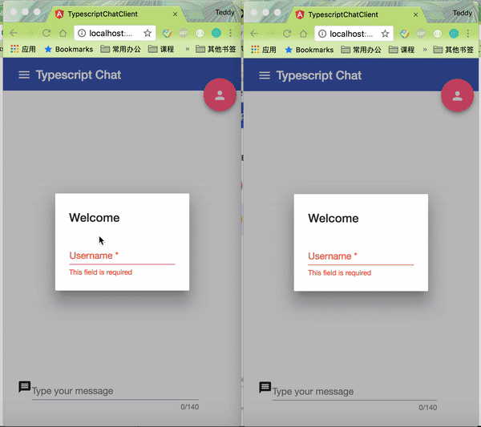

# Socket-IO-Typescript-Chat-App




# Running Server and Client locally
## Prerequisites

1. [NodeJS](https://nodejs.org)
2. [Git](https://git-scm.com)
3. Angular CLI - Install Command Line Interface for Angular [https://cli.angular.io/](https://cli.angular.io/)

After that, use `Git bash` to run all commands if you are on Windows platform.

## Clone repository

```bash
$ git clone https://github.com/zmyzheng/Socket-IO-Typescript-Chat-App.git
$ cd Socket-IO-Typescript-Chat-App
```

## Run Server

To run server locally, just install dependencies and run `gulp` task to create a build:

```bash
$ cd server
$ npm install
$ gulp build
$ npm start
```

The `socket.io` server will be running on port `8080`

## Run Angular Client

Open other command line window and run following commands:

```bash
$ cd client
$ npm install
$ ng serve
```

Now open your browser in following URL: [http://localhost:4200](http://localhost:4200/)